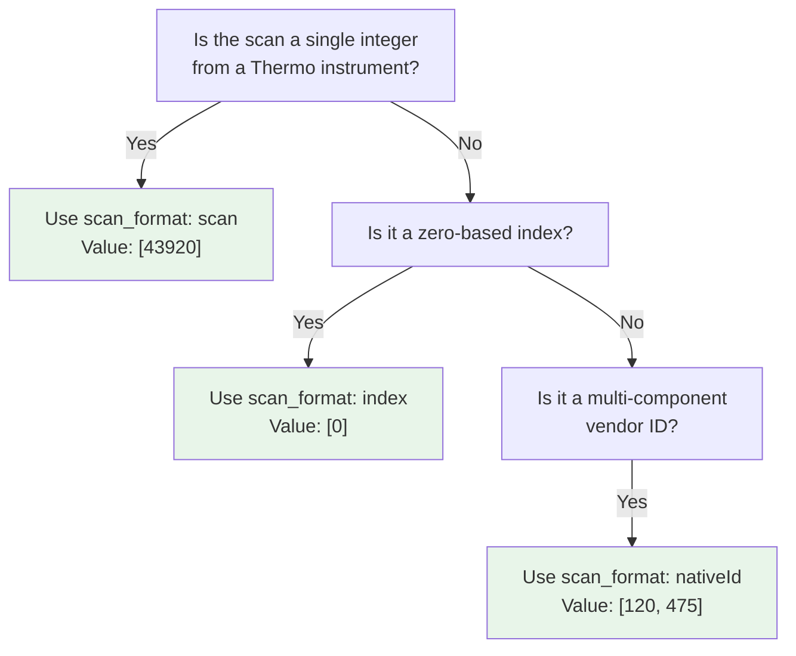

# Scan Numbers

The `scan` field in QPX identifies a specific MS/MS spectrum within a raw or converted spectra file. Because different mass spectrometer vendors use different internal identifiers, QPX defines a consistent encoding convention based on the HUPO-PSI USI (Universal Spectrum Identifier) standard.

A scan value is always stored as an **array of int32** values. For simple instruments with a single scan number, the array contains one element. For instruments with multi-component identifiers, each component is stored as a separate element in the array.

## Instrument-specific formats

Each instrument vendor uses a different native identifier structure. QPX encodes all numeric components in their native order, including repeated values. The default Thermo controller components are the exception described below. The examples are not an exhaustive list of native ID formats.

### Thermo

Thermo instruments use `controllerType`, `controllerNumber`, and `scan` components. Since `controllerType=0` and `controllerNumber=1` are the defaults for mass spectra, only the scan number is stored.

| Native ID | QPX `scan` value |
| --------- | ---------------- |
| `controllerType=0 controllerNumber=1 scan=43920` | `[43920]` |

!!! note
    In rare cases where `controllerType` is not 0 or `controllerNumber` is not 1 (e.g., referencing a PDA spectrum), the full nativeId form must be used: `controllerType=5 controllerNumber=1 scan=7` becomes `[5, 1, 7]`.

### Bruker

Bruker TIMS instruments use a two-component identifier combining frame and scan.

| Native ID | QPX `scan` value |
| --------- | ---------------- |
| `frame=120 scan=475` | `[120, 475]` |
| `frame=120 scan=475 precursor=3` | `[120, 475, 3]` |
| `frame=120 windowGroup=2 scan=475` | `[120, 2, 475]` |
| `merged=0 frame=120 scanStart=4 scanEnd=8` | `[0, 120, 4, 8]` |

### Waters

Waters instruments use a three-component identifier: function, process, and scan.

| Native ID | QPX `scan` value |
| --------- | ---------------- |
| `function=10 process=1 scan=345` | `[10, 1, 345]` |

### AB Sciex

AB Sciex instruments use a four-component identifier: sample, period, cycle, and experiment.

| Native ID | QPX `scan` value |
| --------- | ---------------- |
| `sample=1 period=1 cycle=2740 experiment=10` | `[1, 1, 2740, 10]` |

## The scan_format metadata field

Because the `scan` array alone does not tell a reader how to interpret the integer components, a producer can declare `scan_format` in the Parquet file footer when it knows the format used throughout the file. A one-element array alone cannot distinguish `scan` from `index`.

| `scan_format` value | Meaning | Example scan value |
| ------------------- | ------- | ------------------ |
| `scan` | Simple Thermo-style scan number (1 element) | `[43920]` |
| `index` | Zero-based spectrum index in the file (1 element) | `[0]`, `[1]`, `[2]` |
| `nativeId` | Multi-component native identifier (Bruker, Waters, AB Sciex) | `[120, 475]` |

!!! note "Array length varies by scan_format"
    - `scan` and `index` formats always produce a **single-element** array.
    - `nativeId` format produces arrays of **2 to 4 elements**, depending on the instrument vendor.
    - The `scan_format` metadata field tells the reader how many components to expect and how to interpret them.

The OpenMS consensusXML converter declares this metadata for PSM output when
all encountered spectrum references have the same recognized format. It uses
the original native ID keys, including explicit `scan=` and `index=`, rather
than guessing from array length. Mixed or unknown formats remain undeclared.
Both the in-memory and streaming conversion paths follow this rule.
On PyArrow 14–16, a streaming writer that has already flushed batches cannot
update its footer declaration: conversion warns and leaves `scan_format`
unset. PyArrow 17 or newer supports the late update. A declaration known before
the first batch is written works on all supported versions.

For a declared PSM format, validation checks non-empty scan arrays against the
lengths above. A mismatch is a warning by default and an error under strict
validation, including `qpxc validate`. Legacy files without `scan_format` remain
valid; an unknown historical value produces a warning and skips this check.
This check currently covers standalone local files, not unions of multiple
Parquet shards or partitioned datasets with potentially different declarations.

Feature arrays can contain components from several supporting spectra. This
PSM cardinality check does not apply to Feature output, and the consensusXML
converter does not declare one native-ID format for those combined arrays.

## When to use nativeId vs scan



## Where scan is used

The `scan` field appears in the following QPX views:

| View | Field name | Notes |
| ---- | ---------- | ----- |
| PSM (`psm_file`) | `scan` | Scan of the identified MS/MS spectrum |
| Feature (`feature_file`) | `scan` | Scan components reported by the feature producer |
| MZ (`mz_file`) | `id` | String spectrum identifier, retaining the native ID |

!!! tip
    The OpenMS consensusXML converter can combine components from multiple supporting spectra in `feature.scan`. Use the linked PSM rows to retrieve each complete spectrum identifier; do not treat the combined feature array as one native ID. `id_run_file_name` records the direct identification's run when that origin is known.

## File metadata example

The `scan_format` is stored in the Parquet file metadata alongside other QPX metadata fields.

```python
import pyarrow.parquet as pq

file_metadata = {
    "qpx_version": "1.1",
    "scan_format": "scan",
    "file_type": "psm_file",
    "software_provider": "quantms 1.3.0",
    "project_accession": "PXD012345",
    "creation_date": "2024-06-15",
}

# Attach metadata to the Arrow schema before writing the Parquet file.
encoded_metadata = {key.encode(): value.encode() for key, value in file_metadata.items()}
table = table.replace_schema_metadata({**(table.schema.metadata or {}), **encoded_metadata})
pq.write_table(table, "output.psm.parquet")
```

## Further reading

- [Scores & CV Terms](scores.md) -- additional metadata attached to PSMs and features
- [QPX Format Overview](index.md) -- full list of views and concepts
